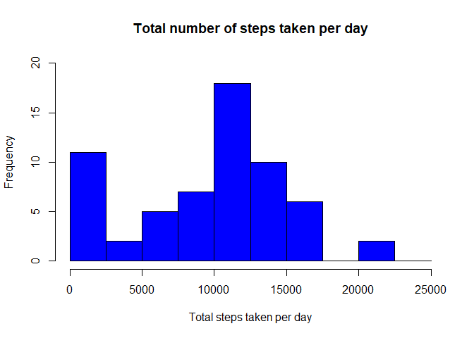
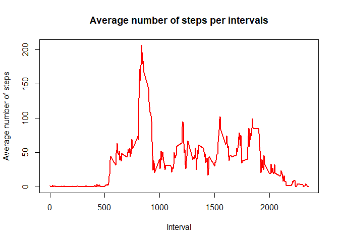
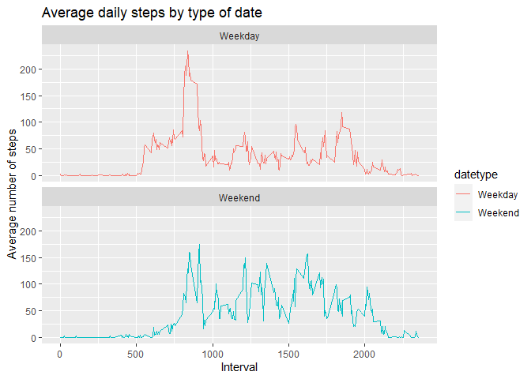

------------------------------------------------------------------------

    ## Loading and preprocessing the data

    library(ggplot2)

    activity <- read.csv("activity/activity.csv")

    activity$date <- as.POSIXct(activity$date, "%Y-%m-%d")
    weekday <- weekdays(activity$date)
    activity <- cbind(activity,weekday)

    summary(activity)

    ##      steps             date               interval        weekday         
    ##  Min.   :  0.00   Min.   :2012-10-01   Min.   :   0.0   Length:17568      
    ##  1st Qu.:  0.00   1st Qu.:2012-10-16   1st Qu.: 588.8   Class :character  
    ##  Median :  0.00   Median :2012-10-31   Median :1177.5   Mode  :character  
    ##  Mean   : 37.38   Mean   :2012-10-31   Mean   :1177.5                     
    ##  3rd Qu.: 12.00   3rd Qu.:2012-11-15   3rd Qu.:1766.2                     
    ##  Max.   :806.00   Max.   :2012-11-30   Max.   :2355.0                     
    ##  NA's   :2304

    ## What is mean total number of steps taken per day?

    activity_total_steps <- with(activity, aggregate(steps, by = list(date), FUN = sum, na.rm = TRUE))
    names(activity_total_steps) <- c("date", "steps")
    hist(activity_total_steps$steps, main = "Total number of steps taken per day", xlab = "Total steps taken per day", col = "blue", ylim = c(0,20), breaks = seq(0,25000, by=2500))

    ## What is the average daily activity pattern?

    average_daily_activity <- aggregate(activity$steps, by=list(activity$interval), FUN=mean, na.rm=TRUE)
    names(average_daily_activity) <- c("interval", "mean")
    plot(average_daily_activity$interval, average_daily_activity$mean, type = "l", col="red", lwd = 2, xlab="Interval", ylab="Average number of steps", main="Average number of steps per intervals")

    ## Imputing missing values

    sum(is.na(activity$steps))

    ## [1] 2304

    imputed_steps <- average_daily_activity$mean[match(activity$interval, average_daily_activity$interval)]

    activity_imputed <- transform(activity, steps = ifelse(is.na(activity$steps), yes = imputed_steps, no = activity$steps))
    total_steps_imputed <- aggregate(steps ~ date, activity_imputed, sum)
    names(total_steps_imputed) <- c("date", "daily_steps")

    hist(total_steps_imputed$daily_steps, col = "darkblue", xlab = "Total steps per day", ylim = c(0,30), main = "Total number of steps taken each day", breaks = seq(0,25000,by=2500))

    ## Are there differences in activity patterns between weekdays and weekends?

    activity$date <- as.Date(strptime(activity$date, format="%Y-%m-%d"))
    activity$datetype <- sapply(activity$date, function(x) {
            if (weekdays(x) == "Saturday" | weekdays(x) =="Sunday") 
                    {y <- "Weekend"} else 
                    {y <- "Weekday"}
                    y
            })
            
     

    activity_by_date <- aggregate(steps~interval + datetype, activity, mean, na.rm = TRUE)
    plot<- ggplot(activity_by_date, aes(x = interval , y = steps, color = datetype)) +
           geom_line() +
           labs(title = "Average daily steps by type of date", x = "Interval", y = "Average number of steps") +
           facet_wrap(~datetype, ncol = 1, nrow=2)
    print(plot)

